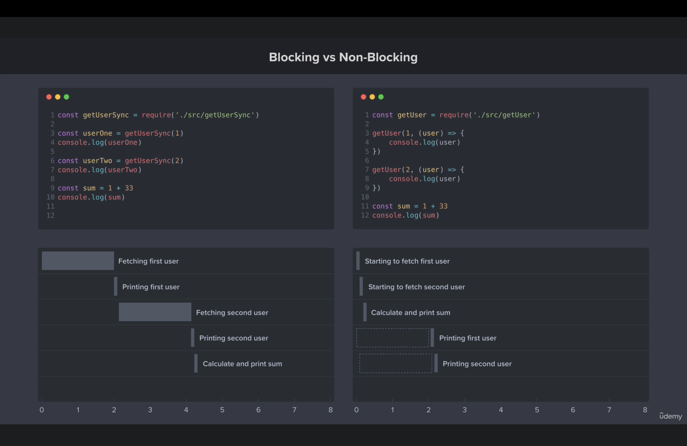

Node.js is Javascript runtime built on Google v8 engine.

- 'Runtime' means its not a language its use Javascript is a language
- Browser has 'window' but for node it doesn't have 'window', it has 'global'
- Browser has 'document' but node doesn't have.
- Browser have 'process' so that we can directly access the env file in react
- but for node doesn't have process so that we use dotenv to access env file in node
- 🚀 blocking vs non-blocking
  

## ⭐️ File system module

- fs.writeFile(file,data[,options],callback) //It will be asynchronus
- fs.writeFileSync(file,data[,options],callback) //It will be synchronous
- Difference between write and append is write will replace the previous data, but append will add the data at the end of the file.
- 'writeFileSync' overwrites existing content, while 'appendFileSync' adds to existing content.
- Both methods create a file if it does not exist, but 'writeFileSync' will replace any existing content.

```javascript
const fs = require("fs");

fs.writeFileSync("notes.txt", "Notes created by node.js");

fs.appendFileSync("notesAppend.txt", " This is an new update");
```

⭐️ npm i validator ⭐️

```javascript
let checkEmail = validator.isEmail("ranajit@gmail.com");
console.log(checkEmail); //true

let checkUrl = validator.isURL("htttps://chatgpt.com/");
console.log(checkUrl); //true
```

## 🚀 Note- Node.js does not support 'import' currently

- We use 'require' instead of 'import'

⭐️ npm install chalk@4 ⭐️

- It is used for colorizing the console output

```javascript
import chalk from "chalk";

console.log(chalk.blue("Hello world!"));
const log = console.log;

// Combine styled and normal strings
log(chalk.blue("Hello") + " World" + chalk.red("!"));

// Compose multiple styles using the chainable API
log(chalk.blue.bgRed.bold("Hello world!"));

// Pass in multiple arguments
log(chalk.blue("Hello", "World!", "Foo", "bar", "biz", "baz"));
```

## 🚀 Note- we can acces command prompt using process.argv

- process.argv[0] is the path to the node executable
- process.argv[1] is the path to the script being run
- process.argv[2] is the first argument passed to the script

```javascript
const command = process.argv[2];
if (command === "start") {
  console.log("Starting...");
} else if (command === "stop") {
  console.log("Stopping...");
}
```
